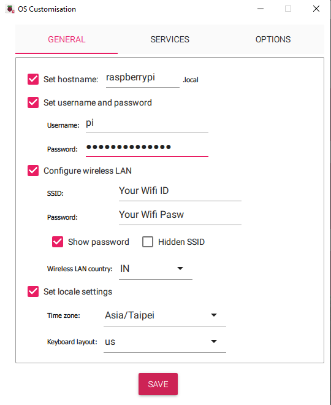
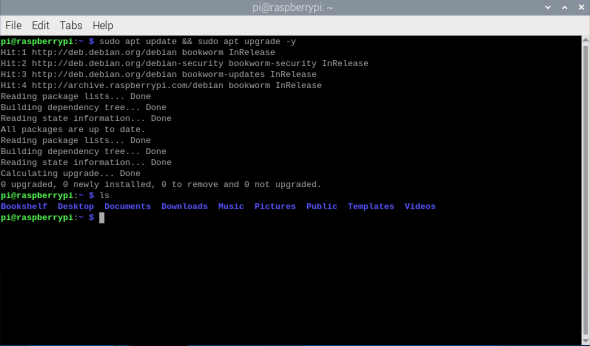

<!-- GitHub Profile README for a Professional PLC & Automation Engineer -->

  

<h1 align="center">Hi, I'm Abdul Karim 👋 Welcom to CODESYS PLC using Raspberry pi 5 </h1>

  <strong>PLC Programmer | HMI & SCADA Developer | Control Panel Designer | Siemens & CODESYS Expert</strong> 
  <i>This Repository is to build DIY PLC for LOW Cost using Raspberry PI and CODESYS for real-world automation solutions using modern industrial technologies</i>

---

## 💼 Table of Contents :

  
Hardwares List

  
- Raspberry Pi 5 (4GB or 8GB)
- microSD card (16GB or higher, Class 10) #Installed PI OS 64 / If not see Installation
- Power supply (USB-C, 5V 3A+)
- Ethernet cable (for stable communication)
- Breadboard
- Jumper wires
- Optional: GPIO-connected 12V push buttons, LED indicators (via relay/level shifter)
- Optional: Raspberry pi TCobbler if using breadboard
- Optional: High voltage appliances (AC/DC)
- Optional: Power Adapter (0-36V DC)
  

  
---

  
Softwares Download and Install

  
- Download and Install [Raspberry Pi Imager](https://downloads.raspberrypi.org/imager/imager_latest.exe) for Windows
- Download and Install [CODESYS](https://store.codesys.com/en/codesys-control-for-raspberry-pi-sl.html) for Windows
- Download and Install [CODESYS Control for Raspberry Pi SL](https://store.codesys.com/en/codesys-control-for-raspberry-pi-sl.html) (SoftPLC runtime) for Windows
- Download and Install [PUTTY](https://www.chiark.greenend.org.uk/~sgtatham/putty/latest.html) on Windows
- Download and Install [WinSCP](https://winscp.net/download/WinSCP-6.5.1-Setup.exe/download) for manual installation
- Download [CODESYS License (free demo or paid full)](https://store.codesys.com/en/codesys-control-for-raspberry-pi-sl.html)
  

---

  
Installation

  &nbsp;&nbsp;&nbsp;&nbsp;
  

    
&nbsp;&nbsp;&nbsp;&nbsp;&nbsp;&nbsp;&nbsp;&nbsp;&nbsp;&nbsp;&nbsp;&nbsp;&nbsp;Raspberry pi Setup

      &nbsp;&nbsp;&nbsp;&nbsp;
      

        
&nbsp;&nbsp;&nbsp;&nbsp;&nbsp;&nbsp;&nbsp;&nbsp;&nbsp;&nbsp;&nbsp;&nbsp;&nbsp;&nbsp;&nbsp;&nbsp;&nbsp;&nbsp;&nbsp;&nbsp;&nbsp;&nbsp;&nbsp;&nbsp;&nbsp;&nbsp;&nbsp;&nbsp;&nbsp;&nbsp;Install Raspberry PI OS     

    
  <h2 align="center">Install Raspberry PI OS 64 into Raspberry PI 5 (RAM more than 4GB)</h2>
    
    - Rasoberry PI 5
    - Micro-SD Card (atleast 16GB) 
    - USB SD Card Reader 
  <!--
  -->
    
    - Open PI Imager
      - Flash “Raspberry Pi OS 64-bit (Lite or Desktop)” to SD card and config additional settings before FLASH.

<table>
  <tr>
    <td align="center">
      Open PI Imager &nbsp;
      
    </td>
    <td align="center">
      Choose Device &nbsp;
      
    </td>
    <td align="center">
      Choose OS &nbsp;
      
    </td>
  </tr>
   <tr>
    <td align="center">
      Select Storage &nbsp;
      
    </td>
    <td align="center">
      Edit Settings &nbsp;
      
    </td>
    <td align="center">
      Configure OS &nbsp;
      
    </td>
  </tr>
   <tr>
    <td align="center">
      Enable SSH and Save &nbsp;
      
    </td>
    <td align="center">
      OS Writing &nbsp;
      
    </td>
    <td align="center">
      OS Verifying &nbsp;
      
    </td>
  </tr>
</table>
<h2 align="center">Once finished Remove SD Card and insert into pi 5  ↓  PUTTY Setup</h2>

&nbsp;&nbsp;&nbsp;&nbsp;

        
&nbsp;&nbsp;&nbsp;&nbsp;&nbsp;&nbsp;&nbsp;&nbsp;&nbsp;&nbsp;&nbsp;&nbsp;&nbsp;&nbsp;&nbsp;&nbsp;&nbsp;&nbsp;&nbsp;&nbsp;&nbsp;&nbsp;&nbsp;&nbsp;&nbsp;&nbsp;&nbsp;&nbsp;&nbsp;&nbsp;PUTTY Setup

      Once PI OS 64/32 Installed on raspberry pi 5
        Open PUTTY and Login with raspberrypi.local -> Click OK
          - Login as: Your pi ID
          - Password: Your pi password 
          # Note password not visible
<table>
  <tr>
    <td align="center">
      PUTTY Login &nbsp;
      
    </td>
    <td align="center">
      PUTTY pi Login &nbsp;
      
    </td>
  </tr>
</table>

        # After successfully logged in get your pi IP
        
          - ifconfig or hostname -I (Keep the IP of your PI similar like Ex: 192.168.xxx.xx)
          - sudo apt update && sudo apt upgrade -y   
 
# To Enable VNC Check below Code snippet

    sudo raspi-config ↓ &nbsp;
  &nbsp;&nbsp;&nbsp;&nbsp;&nbsp;&nbsp;
    

    Click Down Arrow key on keyboad to select "Interface Options" - Use Right Arrow key on keyboard to select "SELECT" Click Enter  ↓ &nbsp;
    

---

    - Use Down Arrow key on keyboard to select VNC - Use Right Arrow key to Select the option click enter and enter again  ↓ &nbsp;
    

---

    - Use Right Arrow key to Select "YES" and Enter  ↓ &nbsp;
     
    --> To finsh the setup use Right arrow key 2 times select Finish and click Enter on keyboard 

<h2>To apply the changes Reboot pi: "sudo reboot"</h2>
<h2 align="center">Once Completed  ↓  Open VNC</h2>

&nbsp;&nbsp;&nbsp;&nbsp;

        
&nbsp;&nbsp;&nbsp;&nbsp;&nbsp;&nbsp;&nbsp;&nbsp;&nbsp;&nbsp;&nbsp;&nbsp;&nbsp;&nbsp;&nbsp;&nbsp;&nbsp;&nbsp;&nbsp;&nbsp;&nbsp;&nbsp;&nbsp;&nbsp;&nbsp;&nbsp;&nbsp;&nbsp;&nbsp;&nbsp;Connect VNC with Raspbery pi

      Open VNC on Windows
      Login with raspberrypi.local -> Click Enter
        - User: Your pi ID
        - Password: Your pi password
        - Open Terminal
        - Update Pi (sudo apt update && sudo apt upgrade -y)
        - sudo shutdown now (To Shutdown Pi)

     
     

# Raspberry Pi is ready to use
   

 

  &nbsp;&nbsp;&nbsp;&nbsp;
  

    
&nbsp;&nbsp;&nbsp;&nbsp;&nbsp;&nbsp;&nbsp;&nbsp;&nbsp;&nbsp;&nbsp;&nbsp;&nbsp;Install CODESYS Control Runtime on Raspberry pi
 
    &nbsp;&nbsp;&nbsp;&nbsp;&nbsp;&nbsp;&nbsp;&nbsp;&nbsp;&nbsp;&nbsp;&nbsp;&nbsp;
  

        
&nbsp;&nbsp;&nbsp;&nbsp;&nbsp;&nbsp;&nbsp;&nbsp;&nbsp;&nbsp;&nbsp;&nbsp;&nbsp;&nbsp;&nbsp;&nbsp;&nbsp;&nbsp;&nbsp;&nbsp;&nbsp;&nbsp;&nbsp;&nbsp;&nbsp;&nbsp;&nbsp;&nbsp;&nbsp;&nbsp;&nbsp;&nbsp;&nbsp;&nbsp;&nbsp;&nbsp;&nbsp;&nbsp;&nbsp;&nbsp;&nbsp;&nbsp;&nbsp;&nbsp;&nbsp;&nbsp;&nbsp;&nbsp;&nbsp;&nbsp;&nbsp;&nbsp;&nbsp;&nbsp;&nbsp;&nbsp;&nbsp;&nbsp;&nbsp;&nbsp;Install CODESYS Control Runtime from Windows

    
  # Install CODESYS Control Runtime from Windows
    
    - Open CODESYS Development System on Windows
    - From CODESYS Development System:
      
      - Go to Tools → Package Manager / Codesys Installer → Browse search below listed 4 package and install
        - ✅ CODESYS Control for Raspberry Pi SL
        - ✅ CODESYS Edge Gateway for Linux
        - ✅ CODESYS Control SL Extension Package
        - ✅ CODESYS SL Deploy Tool
        
    - Boot your Pi with the OS
    - Ensure it's connected to the same network as your PC
    
    - On your Windows PC, open CODESYS Development System
    
    - Go to Tools → Device Installer
    - Install Raspberry Pi runtime:
    - Menu: Tools → Update Raspberry Pi
    - Enter your Pi IP address
    - Provide username (pi) and password (raspberry or your custom)
    
  # It will install runtime over SSH
     
     - In CODESYS → Go to:
     - Tools → CODESYS Control for Raspberry Pi → Update Raspberry Pi
     - Enter your Raspberry Pi’s IP address
     - Choose:
      - Login: pi ( Your ID or default)
      - Password: raspberry (default; change if needed)
      - Select the Demo License (free, 2-hour runtime)
      - Wait for the runtime to install — success message will appear.

  #  Activate License (optional)
    - You can run a demo version (2 hours runtime).
    - For production: Buy license from CODESYS Store and activate via License Manager.
    
  <!--
  -->
  

 

  

        
&nbsp;&nbsp;&nbsp;&nbsp;&nbsp;&nbsp;&nbsp;&nbsp;&nbsp;&nbsp;&nbsp;&nbsp;&nbsp;&nbsp;&nbsp;&nbsp;&nbsp;&nbsp;&nbsp;&nbsp;&nbsp;&nbsp;&nbsp;&nbsp;&nbsp;&nbsp;&nbsp;&nbsp;&nbsp;&nbsp;&nbsp;&nbsp;&nbsp;&nbsp;&nbsp;&nbsp;&nbsp;&nbsp;&nbsp;&nbsp;&nbsp;&nbsp;&nbsp;&nbsp;&nbsp;&nbsp;&nbsp;&nbsp;&nbsp;&nbsp;&nbsp;&nbsp;&nbsp;&nbsp;&nbsp;&nbsp;&nbsp;&nbsp;&nbsp;&nbsp;Manual Installation from Raspberry Pi

  
  # Manual Installation from Raspberry Pi
    Choose anyone ( I'm using VNC, you can use anyone process is same)
      
      -  External Monitor
      -  VNC Software laptop
      -  PUTTY

    - Download or Locate "CODESYS Control for Raspberry Pi SL.deb" file on Windows folder
      Ex: C:\Program Files\CODESYS 3.5.21.0\CODESYS\CODESYS Control for Raspberry PI\Delivery\raspberry

    - Open WinSCP, login with:
    - Host: Your Pi’s ip or rapberrypi.local
    - User: Your ID
    - Password: Your password
    - ✅ Drag & drop the .deb file to any folder (Ex: Downloads).
---

    WinSCP Login &nbsp;
    &nbsp;&nbsp;&nbsp;&nbsp;&nbsp;&nbsp;
     

---

    Locate ".deb" file into your PC, Drag & Drop into pi Folder "Downloads" &nbsp;
  &nbsp;&nbsp;&nbsp;&nbsp;&nbsp;&nbsp;
    

---

    After Successfully Copied ".deb" file into pi folder &nbsp;
  &nbsp;&nbsp;&nbsp;&nbsp;&nbsp;&nbsp;
    

---
  
  # Follow Below Step to Install and Run CODESYS Runtime Successfully
        Open PuTTY / VNC:
          - Enter ip of your Raspberry Pi
          - Login:
            - Username: Your ID
            - Password: Your password

        # PI Comand line (Update pi if needed "sudo apt update && sudo apt upgrade -y")
        - Locate The copied file .deb (Use below command)
        
            > ls (Pi folders)

            > cd Downloads (Copied file folder: you can "cd" where you have copied the ".deb" file)
            
            > ls (You will see .deb file Ex: codesyscontrol_raspberry_4.15.0.0_all.deb)
            
            > sudo dpkg -i [codesyscontrol_raspberry_4.15.0.0_all.deb] ( [] Rename with yours file name)

            > sudo systemctl status codesyscontrol (Check PLC Status Active or Dead)

            > cd (Come back to Starting section)

            > sudo systemctl start codesyscontrol (manual Start PLC Runtime)

            > sudo systemctl status codesyscontrol (#it will show Active)

            > sudo systemctl stop codesyscontrol (#it will stop PLC)
            
  <h3>My PLC already Running so i Turned it Off then Turned it On</h3>    
  
  
  
  # Congrats you have successfully installed CODESYS Runtime into your pi 5
  

  

---

  
PLC Project creation
 
  &nbsp;&nbsp;&nbsp;&nbsp;&nbsp;&nbsp;&nbsp;&nbsp;&nbsp;&nbsp;&nbsp;&nbsp;&nbsp;

  

    
&nbsp;&nbsp;&nbsp;&nbsp;&nbsp;&nbsp;&nbsp;&nbsp;&nbsp;&nbsp;&nbsp;&nbsp;&nbsp;Create a New PLC Project
 
    &nbsp;&nbsp;&nbsp;&nbsp;&nbsp;&nbsp;&nbsp;&nbsp;&nbsp;&nbsp;&nbsp;&nbsp;&nbsp;

  # Create a New PLC Project
      Go to: File → New Project → Standard Project
      Select device:
        CODESYS Control for Raspberry Pi 64 SL (64 bit)
        Choose programming language: Ladder Diagram (LD), ST, etc.

    Project Creation: Go to: File → New Project → Standard Project &nbsp;
    &nbsp;&nbsp;&nbsp;&nbsp;&nbsp;&nbsp;
     

---

    Select the Device :  If no Hardware : WIN v3 64   If using pi 64 : pi 64 SL  &nbsp;
  &nbsp;&nbsp;&nbsp;&nbsp;&nbsp;&nbsp;
     

---

    Choose the logic lagnuage: I'm using "LD" &nbsp;
  &nbsp;&nbsp;&nbsp;&nbsp;&nbsp;&nbsp;
     

---

    Programming Environment &nbsp;
  &nbsp;&nbsp;&nbsp;&nbsp;&nbsp;&nbsp;
   Left side Device's/ POU's/ Modules | Middle LD logic page | Right side LD logic Tools | Upper side Menu &nbsp; 
  &nbsp;&nbsp;&nbsp;&nbsp;&nbsp;&nbsp;
     

  

    
&nbsp;&nbsp;&nbsp;&nbsp;&nbsp;&nbsp;&nbsp;&nbsp;&nbsp;&nbsp;&nbsp;&nbsp;&nbsp;Setup PLC Development Environment without Raspberry pi
 
    &nbsp;&nbsp;&nbsp;&nbsp;&nbsp;&nbsp;&nbsp;&nbsp;&nbsp;&nbsp;&nbsp;&nbsp;&nbsp;

# Setup PLC Development Environment without Raspberry pi

      - If no hardware select Simulation 
      - Click login -> Click Start
      - If have hardware no need to select Simulation

     After  Writing Logic Go to : File → Save → Generate Code (F11) to Compile   Down side you can see if there is any Error or Not &nbsp;
    &nbsp;&nbsp;&nbsp;&nbsp;&nbsp;&nbsp;
     

---

    After Compilation Go to : Online → Click Simulation → Click Login &nbsp;
  &nbsp;&nbsp;&nbsp;&nbsp;&nbsp;&nbsp;
     

---

    You'll see Application in Stop Mode To Run the Code : Ciick on ▶ Play button &nbsp;
  &nbsp;&nbsp;&nbsp;&nbsp;&nbsp;&nbsp;
     

---

    You'll see Application in Run Mode   &nbsp;
  &nbsp;&nbsp;&nbsp;&nbsp;&nbsp;&nbsp;
     

---

    To Change the I/O's : click on → Prepfered value it will show TRUE / FALSE : Click Ctrl + F7 to change the Input state &nbsp;
  &nbsp;&nbsp;&nbsp;&nbsp;&nbsp;&nbsp;
     

---

    You can see the Output Change :   Output LED Turned ON &nbsp;
  &nbsp;&nbsp;&nbsp;&nbsp;&nbsp;&nbsp;
     

---

    Again click on → Prepfered value it will show TRUE / FALSE : Click Ctrl + F7 to change the Input state &nbsp;
  &nbsp;&nbsp;&nbsp;&nbsp;&nbsp;&nbsp;
     

---

    You can see the Output Change :   Output LED Turned OFF &nbsp;
  &nbsp;&nbsp;&nbsp;&nbsp;&nbsp;&nbsp;
     

  

  

    
&nbsp;&nbsp;&nbsp;&nbsp;&nbsp;&nbsp;&nbsp;&nbsp;&nbsp;&nbsp;&nbsp;&nbsp;&nbsp;Setup PLC Development Environment for Raspberry pi
 
    &nbsp;&nbsp;&nbsp;&nbsp;&nbsp;&nbsp;&nbsp;&nbsp;&nbsp;&nbsp;&nbsp;&nbsp;&nbsp;

  # Setup PLC Development Environment for Raspberry pi

    Go to: PLC PRG(PRG): Write down your PLC code -> Save it -> Click Generate code to compile

    - Add devices:
      - GPIO (Digital Input/Output)
      - Modbus, Ethernet/IP, etc. (if needed)
      - Map GPIOs (I/O Configuration)
      - Under “Device → Raspberry Pi GPIOs”
    
    Go to: GPIO's ->
    
     - GPIO parameters 
        -  Select GPIO's as INPUT or OUTPUT
     - GPIO Maping 
      - Select the lader logic variable (click on 3 dot go to PLC program and select) correspond to GPIO

        - Assign I/O's:
          - DI (Digital Input): GPIO pins to push buttons
          - DO (Digital Output): GPIO pins to LEDs (via relay/transistor/pi GPIO's)
      #Note: Raspberry Pi uses BCM pin numbering (GPIO 17 = pin 11).
      
    Go to: Tools -> Deploy Control SL -> Give ip adress, User name, password and connect CODESYS with PI
    Go to: Device -> Scan network -> elect raspberry pi ip -> Click ok
    Go to: Windows Taskber Show Hiden Icons -> right click on .64 -> Start PLC

    Go to: Tools -> Online -> Login -> click Start (F5) to Run
    
      - If no hardware select Simulation 
      - Click login -> Click Start
      - If have hardware no need to select Simulation

  # Your Raspberry Pi is now a fully running PLC using CODESYS!

  

---

## 📁 Featured Projects

| Project       | Description      | Tech Stack |
|---------------|------------------|----------------|
|Raspberry Pi 5 Relay Control| PLC automation with Raspberrypi 5 and Codesys Runtime basic relay control, using push button and LED feedback | CODESYS, Pi 5, LD |

<h2>Bill of Materials (BOM) Example</h2>

| Item                           | Description        | Qty |
| ------------------------------ | ------------------ | --- |
| Raspberry Pi 5 (4GB)           | Main controller    | 1   |
| microSD (128GB)                | Storage            | 1   |
| USB-C PSU (5V 3A) Pi Official  | Power supply       | 1   |
| GPIO TCobbler Board            | Easy I/O access    | 1   |
| 12V Relay Module (16 Channel)  | For output control | 1   |
| 12V LED indicators             | For output test    | 2–4 |
| 3.3V Push Buttons              | For input          | 2–4 |
| 12V power supply               | Relay & LED power  | 1   |
| Ethernet cable / WiFi          | Communication      | 1   |
| Bread Board, Jumper wires      | For Connection     | 1-10|

[▶️ Watch the video](https://github.com/AbdulkarimGit-Tech/Raspberry-Pi-PLC/blob/380e6ad52285033cf51c794ff301bf7d8a179ed5/Project/Pi_PLC_Working.mp4)

# Hardware Circuit  &nbsp;

  &nbsp;&nbsp;&nbsp;&nbsp;&nbsp;&nbsp;
     

---

 # Hardware Wiring  &nbsp;

  &nbsp;&nbsp;&nbsp;&nbsp;&nbsp;&nbsp;
     

---

<h2>Hardware Connection</h2>

  
<table>
  <thead>
    <tr>
      <th>Connection</th>
      <th></th>
      <th>Connection</th>
      <th></th>
    </tr>
  </thead>
  <tbody>
    <tr><td>Raspberry pi VCC</td><td>5v</td><td>Relay Channel</td><td>5v</td></tr>
    <tr><td>Raspberry pi GND</td><td>GND</td><td>Relay Channel</td><td>GND</td></tr>
    <tr><td>Raspberry pi GPIO</td><td>23</td><td>Relay Channel</td><td>IN 7</td></tr>
    <tr><td>Raspberry pi GPIO</td><td>24</td><td>Relay Channel</td><td>IN 6</td></tr>
    <tr><td>Raspberry pi GPIO</td><td>3.3v</td><td>4x4 PB Matrix</td><td>R 1</td></tr>
    <tr><td>Raspberry pi GPIO</td><td>17</td><td>4x4 PB Matrix</td><td>C 1</td></tr>
    <tr><td>Raspberry pi GPIO</td><td>18</td><td>4x4 PB Matrix</td><td>C 2</td></tr>
    <tr><td>Raspberry pi GPIO</td><td>22</td><td>4x4 PB Matrix</td><td>C 3</td></tr>
    <tr><td>Raspberry pi GPIO</td><td>27</td><td>4x4 PB Matrix</td><td>C 4</td></tr>
    <tr><td>Relay Channel VCC</td><td>12v</td><td>12v Power Supply</td><td>VCC</td></tr>
    <tr><td>Relay Channel GND</td><td>GND</td><td>12v Power Supply</td><td>GND</td></tr>
    <tr><td>Relay Channel D7</td><td>NO</td><td>Connected to Green LED +ve</td><td>12v</td></tr>
    <tr><td>Relay Channel D7</td><td>COM</td><td>Connected to 12v Power VCC + D6 COM</td><td>12v</td></tr>
    <tr><td>Relay Channel D6</td><td>NO</td><td>Connected to Red LED +ve</td><td>12v</td></tr>
    <tr><td>Relay Channel D6</td><td>COM</td><td>Connected to 12v Power VCC + D7 COM</td><td>12v</td></tr>
    <tr><td>12v Green LED</td><td>GND</td><td>Connected to 12v Power GND + D6 COM</td><td>12v</td></tr>
    <tr><td>12v Red LED</td><td>GND</td><td>Connected to 12v Power GND + D6 COM</td><td>12v</td></tr>
  </tbody>
</table>

---

# PLC Ladder Logic ex:

  &nbsp;&nbsp;&nbsp;&nbsp;&nbsp;&nbsp;
     

---

<i>#NOTE: I have used Active High GPIO's in Raspberry PI 5 and Active Low input Relay Channel so i have inverted my Active HIGH GPIO OUT Logic to LOW in my Code</i>

---

## Code Snipit

## 🔌 Tech Stack

### PLC & SCADA

### Programming Languages

### Control Panel & Electrical Design

<!--  -->

### DevOps & Cloud Tools

---

## 🌐 Connect with Me

  
 

---

## 💡 GitHub Repositories

- [AbdulkarimGit-Tech](https://github.com/AbdulkarimGit-Tech/AbdulkarimGit-Tech) – Main Repositories

---

## ☕ Support My Work

---

<!-- Proudly built with real-world hands-on experience. Engineering Automation, One Project at a Time. -->
